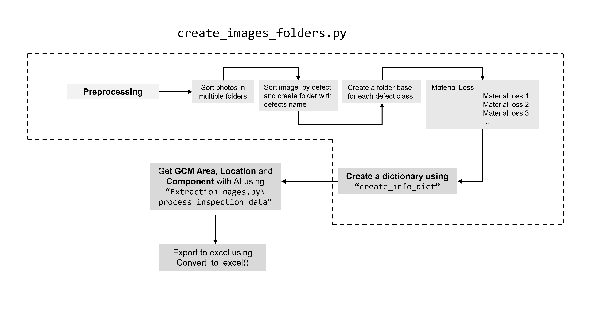

# PDF Structural Risk Assessment

## Repository Overview

This repository contains tools and scripts for performing structural risk assessments and processing related data.

### File Descriptions

- **FFPDF.py**: Creates structural risk assessments in PDF format.
- **Factory_from_excel.py**: Loads information to create Pydantic models that are defined in `Classes.py`.
- **Classes.py**: Contains Pydantic models used throughout the project.
- **Extraction_images.py**: Processes images related to structural assessments.
- **Extraction_test.py**: Contains the `getextraction` function which, based on the metadata of the images, retrieves the Location, Component, and Description and returns a Pydantic model.
- **Preprocesing.py**: Handles preprocessing tasks for data and images.
- **Complete_PDFs**: Directory for storing completed PDF reports.
- **Cost_Estimation**: Tools for estimating costs associated with structural risks.
- **Defects_Groups**: Contains scripts and data for grouping structural defects.
- **Merge_excel**: Utilities for merging Excel files.
- **Templates**: Contains templates used for generating reports and assessments.
- **Utils**: Utility scripts and helper functions.

### Getting Started

1. Clone the repository.
2. Install the required dependencies.
3. Run the scripts as needed to perform structural risk assessments and process data.

### Usage

Detailed usage instructions for each script can be found in their respective docstrings and comments.

For any questions or issues, please open an issue on GitHub.

